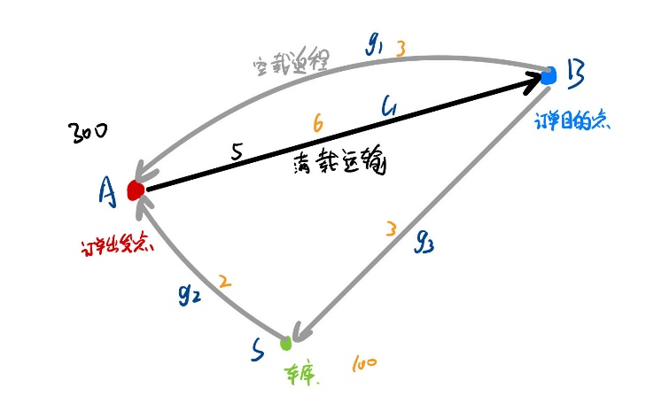
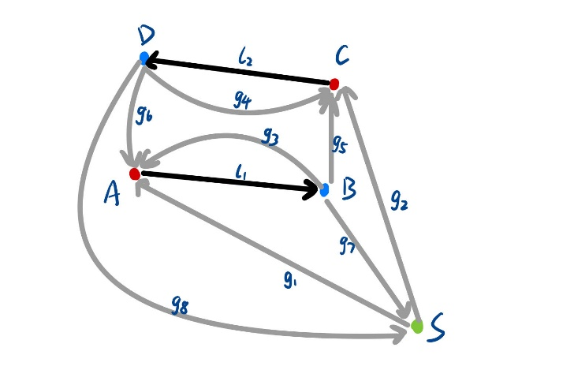

# 简化模型v1
## 一、问题描述：

假设在某天一个区域内有一系列运输订单需要处理，一个订单可以认为是有指定重量的货物需要从一个货物起点运往一个货物终点，已知任意两个运输点间的运输距离，每辆车的最大载货量、每辆车的最大电量，寻找将全部货物运输到货物终点的最少运货车辆数。

## 二、模型假设：

1. 假设每辆车的最大载货量相同，自重相同；

2. 每个订单之间的货物是不一样的，对于一个订单，必须由货物起点运往货物终点，但是每辆货车都可以运载每个订单的货物；

3. 运载货物较大，一般需要多辆货车多次运输，货物运输到目的地之后，需要行驶到货物起点重新载货，假设一开始车库里有任意数量的电量充足的运货车，运货车的最终终点必须在停在车库。不考虑货车可以在车库外充电的情况；

4. 运货车的载货量与耗电量成正比；

5. 运货车每次装载货物时，都尽可能多的装载，运到货物终点时将货物全部卸下；

## 三、问题分析：

想要满足每一个订单的运货需求，最简单的运输方案是分别为每个订单安排一定数量的货车，由货车所在车库出发，在订单出发点和订单目的点之间循环往复的运输，在电量耗尽之前返回车库，如图1所示：

假设一辆车的初始电量为100，执行空载路径$g_{1}$消耗电量3，$g_{2}$消耗电量2，$g_{3}$消耗电量3，执行满载路径$l_{1}$消耗电量6。一辆车可以执行g2->l1->g1×10->g3的运输路径，总共在订单出发点和订单目的点之间往复10次，最后返回车库。假设每次货车可以运输5单位的货物，订单包含有300个单位的货物需要从A点运往B点，一辆车最多能够运输50单位的货物，最少需要6辆车。

当一个区域内有多个订单需要运输的时候，就可以在设计运货路线的时候，将不同订单串起来。例如，在一辆车运完一次一个订单之后，可以开往另一个订单的出发点，装另一个订单的货物，运往另一个订单的目的点。通过尽量减少货车空载的行驶距离，节省电量，从而增加满载的运输次数，能够更有效的利用货车电量。例如在图2中有$A \rightward B$，C→D两个订单，在一辆车执行完满载路径l1之后，既可以选择执行空载路径g3返回A点继续向B点运输货物，也可以选择执行空载路径g5，前往C点载货之后向D点运货。只要在电量耗尽之前返回车库S，就可以看作是一条可行的运输路径。

## 四、列生成模型

建模思想，假设知道所有的运输路径$R$，问题就变成了最小化满电出发车辆数，即最小化运输路径执行个数。

一条运输路径包含了空载路径和满载路径交替的一系列路段串。

满载路段：由订单起点指向订单终点；

空载路段：由订单终点指向订单终点，或者由车库指向订单起点、由订单终点指向车库；

每执行一个满载路段，就相当于为一个订单的目的地运输一次货物；

R：全部的运输路径集合，∀r∈R；

yr：yr≥0,yr∈Z,∀r∈R，表示某一运输路径执行的次数；

F：满载路段集合，∀f∈F，F表示订单个数；

G：空载路段集合，∀g∈G；

df：满载路段f∈F的需求运输量，也可以看作是满载路段f∈F的订单货量数；

μ：每辆运输车最大载重量；

M：每辆运输车最大电容量；

af,r：af,r≥0,af,r∈Z,∀r∈R，表示满载路段f∈F在运输路径r∈R中的执行次数；

ag,r：ag,r≥0,ag,r∈Z,∀r∈R，表示空载路段g∈G在运输路径r∈R中的执行次数；

mf：满载路径的耗电量；

mg：空载路径的耗电量；

限制主问题RMP：

minr∈Ryr#1

s.t. μr∈Raf,ryr≥df,∀f∈F#2

yr≥0,∀r∈R#3

公式（1）表示，优化目标为最小化路径执行次数，也就是最小化货车数量；公式（2）表示，对于每一个订单，在所有运输路径的中的总运输重量，满足订单的需求运输量；公式（3）为决策变量约束，这里已经进行了线性松弛。

限制主问题的对偶问题DRMP为：

maxf∈Fπfdf#4

s.t.μf∈Fπfaf,r≤1,∀r∈R#5

πf≥0,∀f∈F#6

列生成算法的简约数（Reduce Cost）即为不满足公式（5）的运输路径。简约数RC为

RC=1-μf∈Fπfaf,r#7

公式（7）表示，我们需要找到一条在电量耗尽之前，尽可能多的包含满载路段的一条运输路径。

定义：

xf：xf≥0,xf∈Z，表示在一条运输路径中，满载路段f∈F被执行xf次；

xg：xg≥0,xg∈Z，表示在一条运输路径中，空载路段g∈G被执行xg次；

V：所有运输节点集合；

s：s∈V，表示车库运输节点；

O-v：与节点v∈V相连的所有流出运输路径；

O+v：与节点v∈V相连的所有流入运输路径；

bv,l=1,if l∈O+v,-1,if l∈O-v0,otherwise.,∀v∈V：表示每个运输节点的流入流出运输路径关联矩阵；

hg,s=1, if g∈O-s,0,otherwise.：表示车库运输节点s的流出运输路径的关联矩阵；

子问题SP形式为：

maxf∈Fπfxf#8

f∈Fmfxf+g∈Gmgxg≤M#9

f∈Fbv,fxf+g∈Gbv,gxg=0,∀v∈V#10

g∈Ghg,sxg=1#11

xf≥0#12

xg≥0#13

公式（8）表示优化目标为最大化选中的满载路段个数；公式（9）表示，运输路径在满载路径和空载路径上的耗电量的总和不超过车辆的最大电量；公式（10）表示，对任意一个运输节点，流入的运输路径的执行次数等于流出的运输路径的执行次数；公式（11）表示对于车库运输节点，必须有一个流出路径.

假设子问题的最优值为z=f∈Fπfxf，如果μz>1则表示存在不满足公式（5）的运输路径，将这条路径加入到限制主问题的运输路径集合R中，继续迭代；如果μz≤1，则表示限制主问题已经达到最优解。

## 五、模型扩展

1. 多车库问题

    在第四章中，仅仅考虑了有一个车库s的问题，当一个区域内有多个车库的时候，整体模型不需要大改，只需要增加子问题的个数。根据公式（7），当限制主问题RMP没有达到最优解时，需要判断是否存在使得简约数RC<0的运输路径，这个运输路径的出发点并没有限制。所以，如果一个区域内有m个车库，在求解子问题时就需要求解m个子问题，如果存在任意一个由某一车库出发的运输路径使得RC<0，就可以加入到限制主问题中，继续迭代。

2. 考虑可以换电池的问题

    假设一个区域内有一个换电站，换电站内有固定数量的满电电池可供更换，依然可以保持主问题的形式不变，需要在求解子问题时，考虑在运输路径中加入前往换电站更换电池的路径，再求最长的运输路径。

3. 考虑可以充电的问题

    假设一个区域内有充电站，货车可以在运输过程中前往充电站充电，就需要考虑每条运输路径的运输时间不超过规定的时间。运输时间包括运输路径的时间、充电时间。

4. 考虑不同时间充电费用不同的问题

    将时间离散化，每个离散时间内电价不同。
